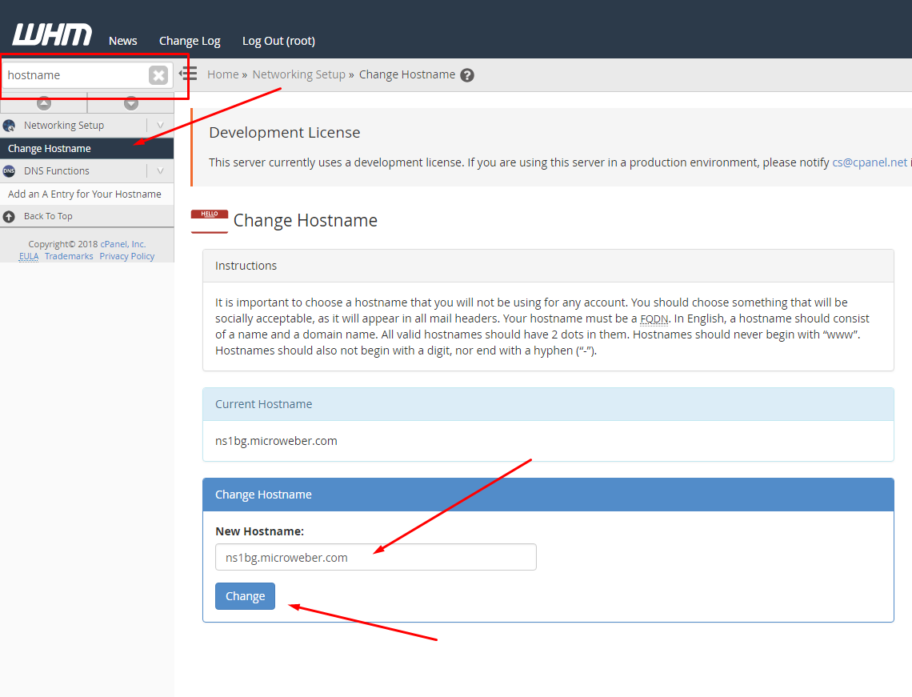
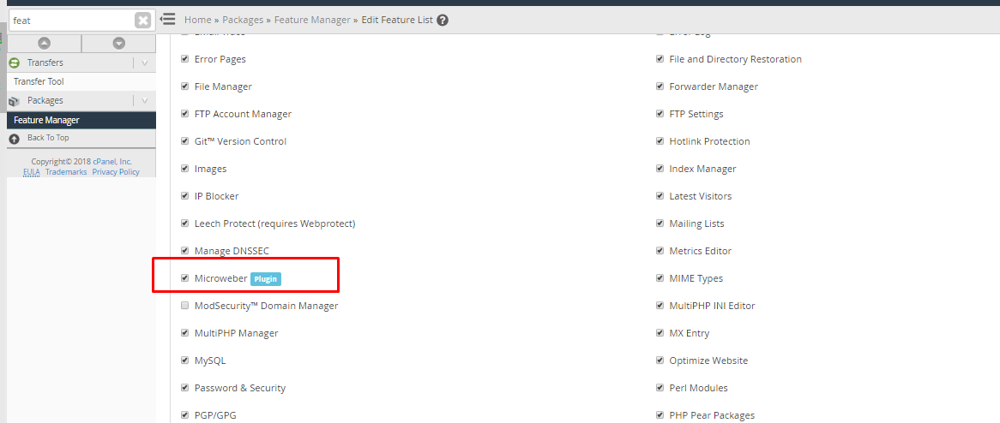
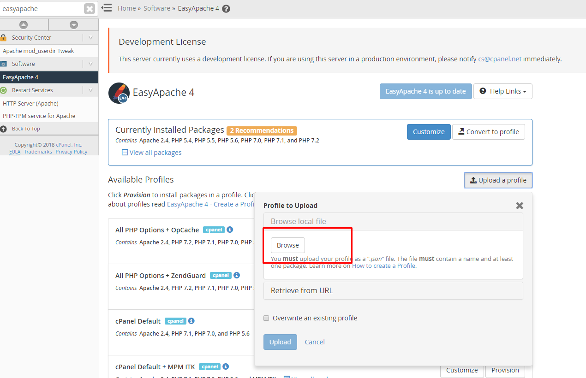
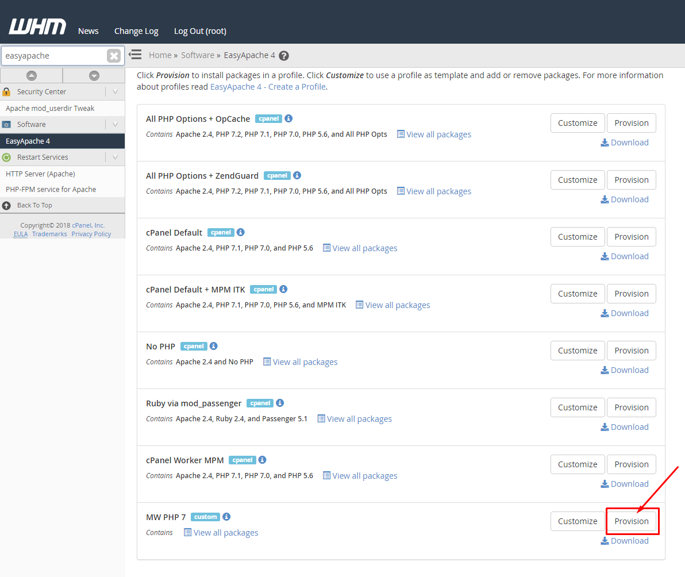
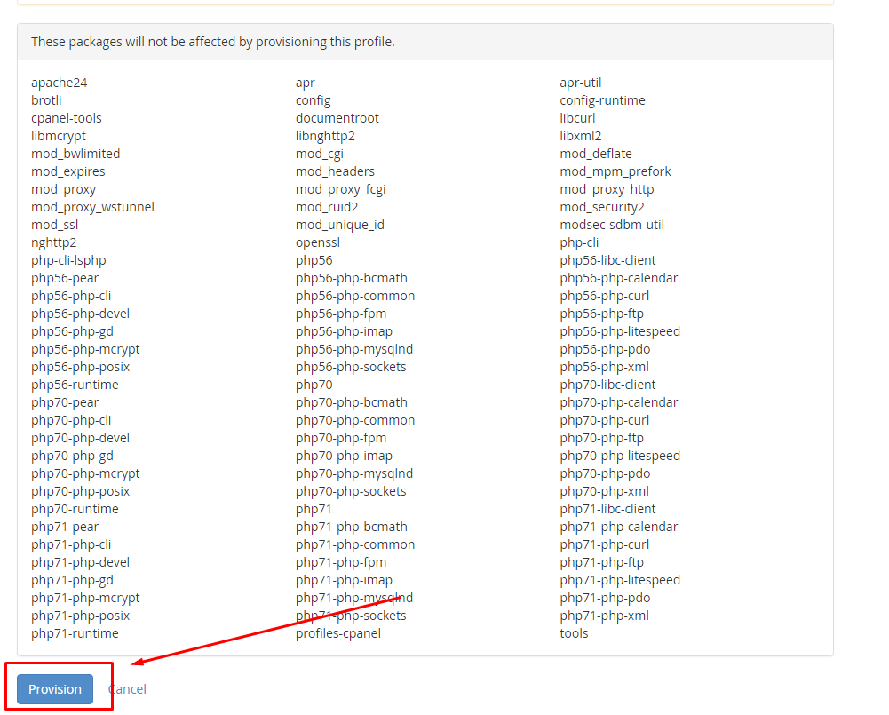
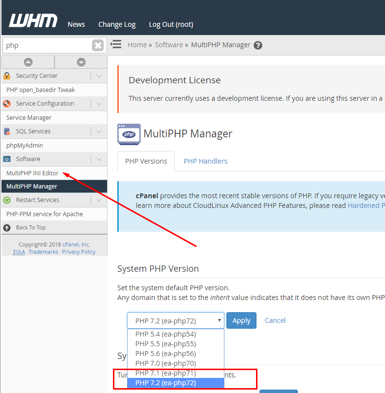

# cPanel Microweber Plugin

## Installation


### Using RPM

Run the following commands in the Terminal:

```
wget http://download.microweberapi.com/cpanel/microweber-cpanel.rpm
yum install microweber-cpanel.rpm
```
 
### Manual installation

* Get the plugin source code from [microweber-dev/cpanel-plugin](https://github.com/microweber-dev/cpanel-plugin).
* Place the files in `/usr/local/cpanel/microweber`.
* Run the following script:

```
/usr/local/cpanel/microweber/install/installer.sh
```

### Update 

```
wget http://download.microweberapi.com/cpanel-plugin/microweber-cpanel.rpm
rpm -Uvh microweber-cpanel.rpm
```

### Uninstall
 
* Run the following script:

```setup_acl.png
/usr/local/cpanel/microweber/install/uninstall.sh
```


 
# Usage 

### You must set your real hostname



### Select the feature list you want to edit 
Select the feature list, click on "edit" button and add the Microweber feature



### Setup EasyApache 4



Make sure you have the required php extensions enabled. 

You need mb_string and iconv and other extesions ebabled. You can import the EasyApache4 Profile from this file [easyapache_profile.json](assets/easyapache_profile.json "")

Then you have to provision the EasyApache Profile.






Also please try to use PHP 7+, so the future versions of Microweber will work. 




 ## Find The Plugin

* Login to WHM, search for "Microweber" and open the plugin settings page.
* Add the "Microweber" feature to plans you wish to have Microweber installed with them.
* Login to cPanel and open the plugin under "Software". From that page Microweber can be manually installed to any of the user's domains.

### Search for Microweber in the sidebar


### You now need setup your database type and install type 


* If you select "Automatically install Microweber on new domains creation" , this will install the system when you create new user. 
* If you select "Allow users to Manually install Microweber from cPanel" , this will allow the users to install manually when they login in their panel
* If you select "Disabled for all users" this will disable the system for all users


### For Symlink setup

If you use Symlink configuration you can save a lot of disk space and use single code-base for all websites

Make sure your check on  And set `Symlink Protection` to "Off" under "Apache Configuration > Global Configuration"


 


## You are ready. 

Now if you make new domain with a plan that has the "microweber" feature, you will see a website created automatically. 


